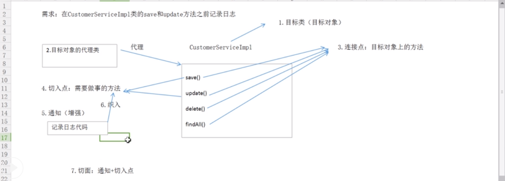

# AOP 面向切面编程
* AOP的意义：利用AOP可以对业务逻辑的各个部分进行隔离，从而使得业务逻辑各部分之间的耦合度降低，提高程序的可重用性，同时提高了开发的效率。
* AOP的实现：动态代理
## 术语
* 目标对象（target): 被代理对象
* 代理对象(proxy)
* 连接点(joinpoint)：被代理对象的方法
* 切入点(pointcut)：要被通知（增强）的方法
* 通知（增强）(advice)：具体的业务内容
* 织入(weaving)：通知（增强）的过程
* 切面(aspect)：通知+切入点

